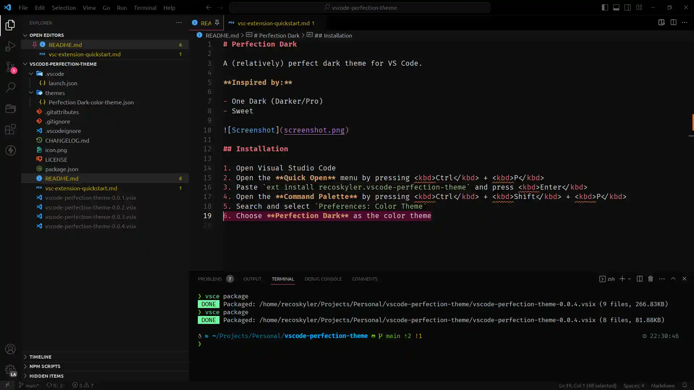

# Perfection Dark

<a href='https://ko-fi.com/supportkofi' target='_blank'>

A (relatively) perfect dark theme for VS Code.

**Inspired by:**

- One Dark (Darker/Pro)
- Sweet

## Installation

1. Open Visual Studio Code
2. Open the **Quick Open** menu by pressing <kbd>Ctrl</kbd> + <kbd>P</kbd>
3. Paste `ext install recoskyler.vscode-perfection-theme` and press <kbd>Enter</kbd>
4. Open the **Command Palette** by pressing <kbd>Ctrl</kbd> + <kbd>Shift</kbd> + <kbd>P</kbd>
5. Search and select `Preferences: Color Theme`
6. Choose **Perfection Dark** as the color theme
